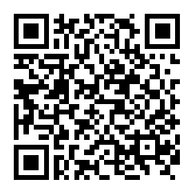

# lan-ui

> 基于Vue.js实现的精致移动端组件库

### 导航

- [首页](https://lan-ui.github.io/)
- [文档](https://lan-ui.github.io/#/zh-CN)
- [示例](https://lan-ui.github.io/#/zh-CN/example)

  

### 新项目？

- vue cli > 3
  推荐使用vue-cli-plugin-lan-ui插件，创建项目及配置，说明文档详见[vue-cli-plugin-lan-ui](https://www.npmjs.com/package/vue-cli-plugin-lan-ui)

- vue cli < 3
  推荐使用lan-ui模版创建项目，创建项目及配置，说明文档详见[lan-ui-template](https://github.com/lan-ui/lan-ui-template)

### 安装

```shell
npm install lan-ui --save
```

### 使用

```js
import Vue from 'vue'
import Lan from 'lan-ui'

Vue.use(Lan)
```

#### 按需使用

```js
import Vue from 'vue'
import {
  /* eslint-disable no-unused-vars */
  Style,
  Button,
  ActionSheet
} from 'lan-ui'

Vue.use(Button)
Vue.use(ActionSheet)
```

注：  
上述使用依赖插件 [babel-plugin-transform-modules](https://www.npmjs.com/package/babel-plugin-transform-modules)  
详细内容请看 [快速上手文档](https://lan-ui.github.io/#/zh-CN/docs/quick-start)

### ToDo

- 更多组件

- 主题支持

### Development

```shell
git clone https://github.com/lan-ui/lan-ui.git
cd lan-ui
npm install
npm run dev
# or run document development
npm run doc-dev
```

### Changelog

详细日志请看[发布日志]
